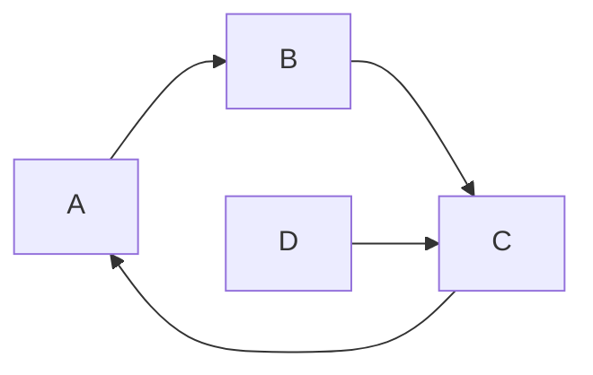

# Graph
集合论与图论相关

主要是代码和图论实验报告

## 配置Markdown
1. 配置MathJax
测试如下:

})

2. 配置Mermaid
测试如下

```mermaid
graph LR
A-->B
B-->C
C-->A
D-->C
```

graph LR
A --- B
B-->C[fa:fa-ban forbidden]
B-->D(fa:fa-spinner);

